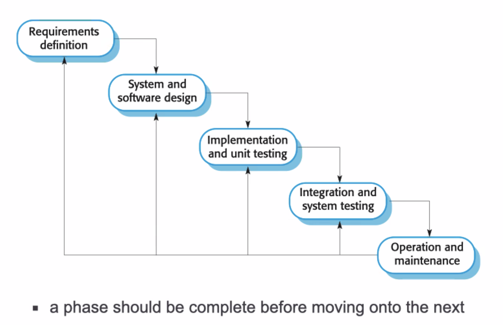
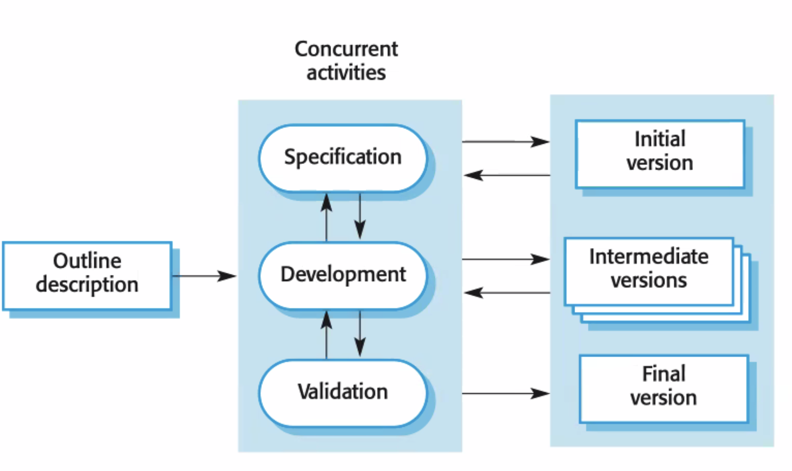
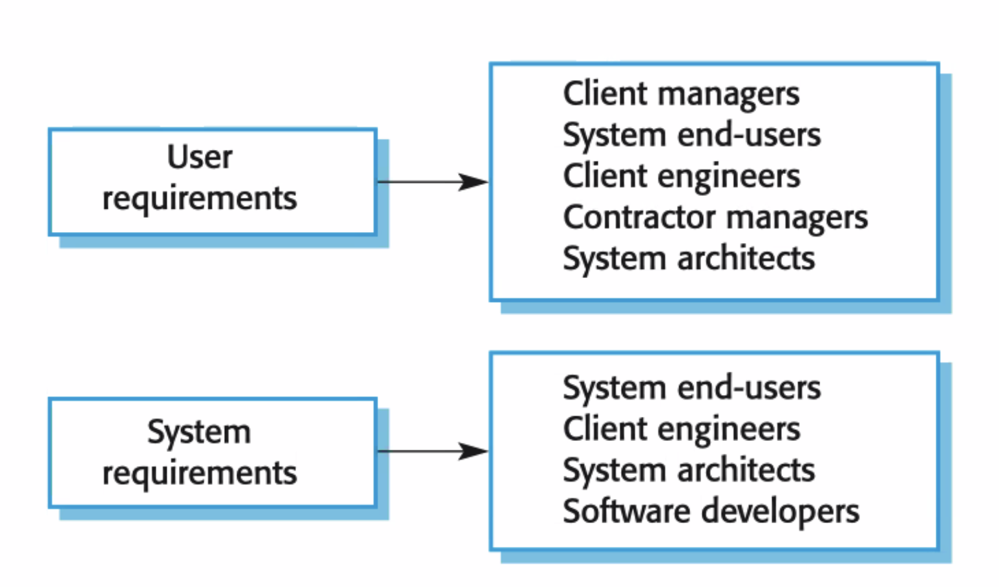
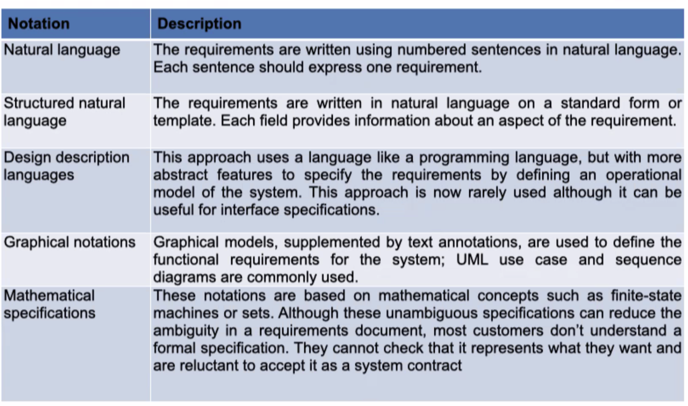
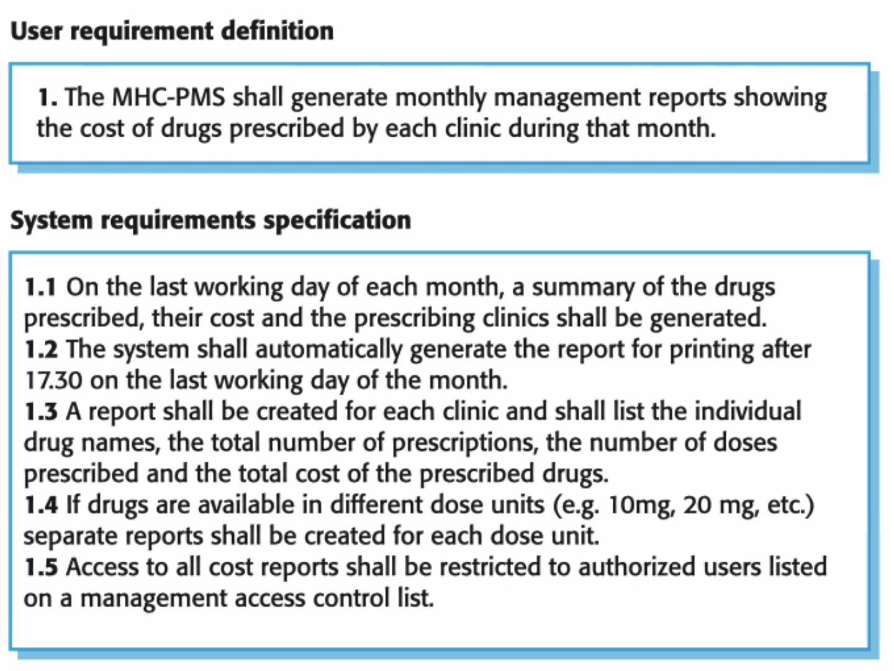
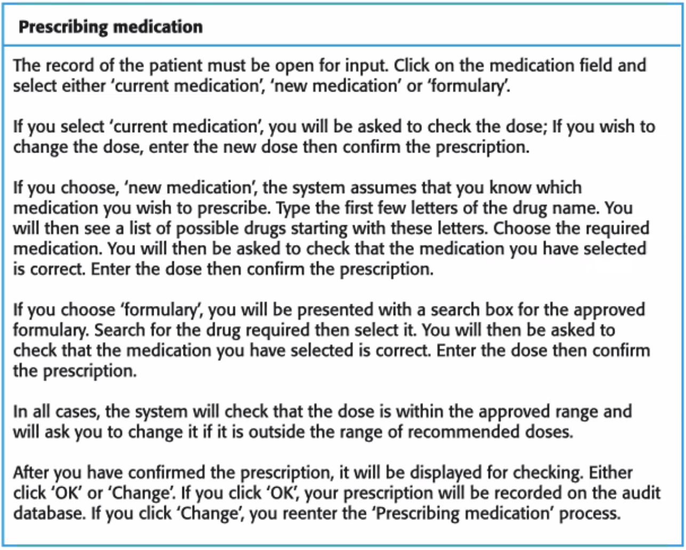

# Maneesh Wijewardhana

## Software Processes (Lec 1)

- Specification (Requirements)
  - defining what the system should do
- Design
  - definition the organization of the system
- Implementation
  - implementing the system
- Testing and Validation
  - checking that it performs as planned (verification)
  - checking that it does what the customer wants (validation)
- Evolution
  - changing the system in response to changing customer needs

## Software process descriptions (Lec 2)

- when discussing process, we usually talk about
  - activities in these processes:
    - specifying a data model
    - designing a user interface, etc.
  - ordering of these activities
- process descriptions may also have
  - **products**
    - outcomes of a process activity
  - **roles**
    - the responsibilities of the people involved in the process
  - **pre- and post- conditions**
    - statements that are true before and after a process activity has been enacted or a product produced

### Plan-driven and agile processes

- **Plan-driven**
  - processes where all the process activities are planned in advance and progress is measured against this plan
- **agile**
  - planning is incremental and it is easier to change the process to reflect changing customer requirements
- in practice, most practical processes include elements of both plan driven and agile (there are no right or wrong software processes)

### Software process models

- **The waterfall model**
  - plan driven
  - separate and distinct phases of specification and development
    - 
    - advantages:
      - encourages 'big picture' perspective
      - easier to make changes in planning stage
      - prevents 'writing yourself into a corner'
      - helps keep remote teams 'on the same page'
    - disadvantages:
      - Difficulty of accommodating change after the process is underway (phase has to be complete before moving on to next)
      - Inflexible partitioning of the project into distinct stages makes it difficult to response to change customer requirements
    - $\therefore$ use this model when requirements are well understood and changes will be limited (few businesses have this though)
- **Incremental development**
  - Specification, development, and validation are interleaved
  - can be plan-driven or agile
    - 
    - advantages
      - reduces cost of accommodating changing customer requirements
      - easier to get customer feedback on the dev work that is done
      - More rapid delivery and deployment of useful software to the customer is possible
      - allows for the 'debugging' of spec and designs
    - disadvantages
      - process is not visible
      - managers need regular deliverables to measure progress. If systems are dev'd quickly, not cost-effective to produce docs that reflect every version
      - system structure tends to degrade as new increments are added
      - regular change tends to corrupt structure
- **Reuse-oriented software engineering**
  - The system is assembled from existing components
  - can be plan-driven or agile
- in practice, most large systems are developed using a process that incorporate elements from all of these models

### Process activities

- Real software processes are inter-leaved sequences of technical, collaborative and managerial activities with the overall goal of specifying, designing, implementing and testing a software system
- The four basic process activities of specification, development, validation, and evolution are organized differently in different dev processes. In waterfall, they are organized in sequence whereas incremental dev they are interleaved

### Software specification

- The process of establishing what services are required and the constraints on the system's operation and development
- requirements engineering process
  - feasibility study (is it technically and financially feasible to build the system?)
  - Requirements elicitation and analysis (what do the system stakeholders require or expect from the system)
  - requirements specification (defining the requirements in detail)
  - requirements validation (checking the validity of the requirements)

### Requirements Engineering

- Establish
  - the services that the customer requires from a system
  - the constraints under which it operates and is developed
- Ranges from
  - a high-level abstract statement of a service or of a system constraint
  - to a detailed mathematical function specification
- This range happens because they serve a dual function
  - the basis for a bid for a contract $\therefore$ must be open to interpretation
  - the basis for the contract itself $\therefore$ must be defined in detail
  - both of these may be called requirements

### Types of requirement

- User requirements
  - statements in natural language + diagrams of the services the system provides and its operational constraints
  - written for customers
- System requirements
  - a structured document setting out detailed descriptions of the system's functions, services and operational constraints
  - Defines what should be implemented so may be part of a contract between client and contractor
  - 

### Requirements document variability

- information depends on type of system and approach to development used
- incrementally development typically have less detail
- standards such as IEEE standard (applicable for large systems engineering projects)

### Requirements specification

- process of writing down user and sys requirements
- user ones need to be understandable by end users and customers without tech background
- sys ones are more detailed and include more tech details
- requirements may be part of a contract for the system development $\therefore$ need to be as complete as possible

- 

### Requirements and design

- In principle, requirements should state what the system should do and the design should describe how it does this
- In practice, the two are inseparable
  - A system architecture may be designed to structure the requirements
  - The system may inter-operate with other systems that generate design requirements
  - The use of specific architecture to satisfy non-functional requirements may be a domain requirement
  - may be the consequence of a regulatory requirement

### Natural language specification

- written as natural language supplemented by diagrams and tables
- used bc expressive, intuitive, universal

### Guidelines for writing requirements

- invent a standard format and use for all
- use consistent language (use shall for mandatory and should for desirable)
- text highlight key parts
- avoid computer jargon
- include explanation of why a requirement is necessary
  - 
- this is a user story example where each paragraph and be a task (agile)
  - 
- User stories **should**
  - [x] describe 1 thing that the software needs to do for the customer
  - [x] be written in a language that the customer understands
  - [x] be written by the customer
  - [x] be short (no more than 3 sentences)
- User stories should **not**
  - be a long essay
  - use tech terms
  - mention specific technologies
