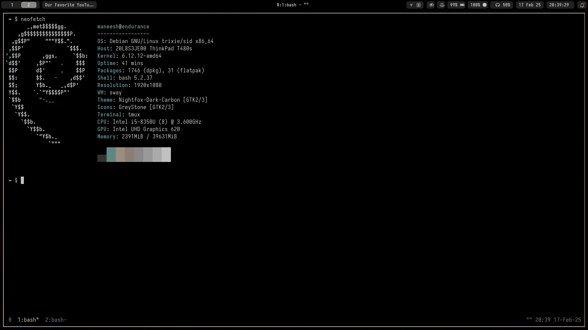
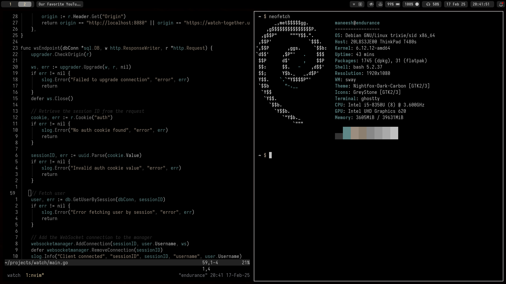
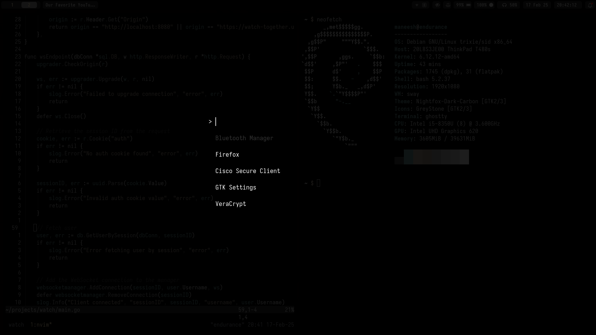
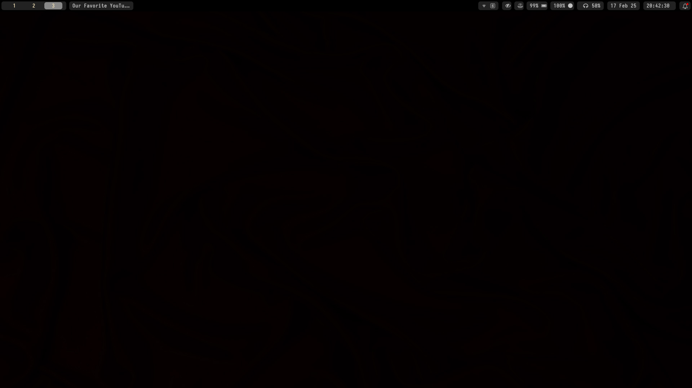

# Dotfiles

- Programs in my daily workflow:
  - **Currently** Debian Trixie
  - Bash
  - Sway
  - Waybar
  - Ghostty
  - Neovim
  - Tmux
  - Yazi
  - Tofi
  - Custom scripts

and the most simple colourscheme which is base-16-black-metal-gorgoroth

# Screenshots

